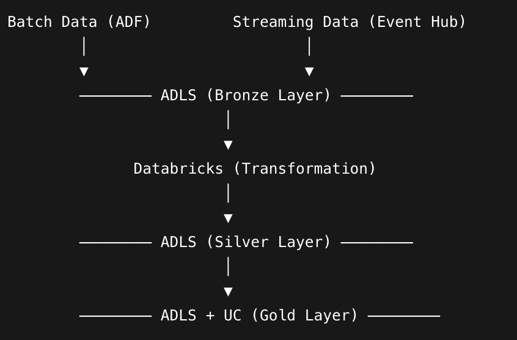

### Real-Time Data Pipeline (Batch + Streaming) on Azure

**Project Overview**
Designed and implemented an end-to-end hybrid data pipeline combining batch and real-time streaming processing using Azure services. The project follows Medallion Architecture (Bronze → Silver → Gold) with secure, production-level practices.

**Objectives**
- Process both batch and streaming data in a unified architecture
- Implement scalable and fault-tolerant pipelines
- Apply secure authentication (OAuth + Key Vault)
- Build modular and reusable Databricks notebooks
- Generate business KPIs for analytics (Gold layer)

Batch Data (ADF)         Streaming Data (Event Hub)
        │                        │
        ▼                        ▼
        ──────── ADLS (Bronze Layer) ────────
                        │
                        ▼
              Databricks (Transformation)
                        │
                        ▼
        ──────── ADLS (Silver Layer) ────────
                        │
                        ▼
        ──────── ADLS + UC (Gold Layer) ────────

**Tech Stack:**
- Azure Data Factory (ADF)
- Azure Event Hub
- Azure Data Lake Storage Gen2 (ADLS)
- Azure Databricks (PySpark)
- Azure Stream Analytics
- Azure Key Vault
- Microsoft Entra ID (Service Principal)
- Unity Catalog

**Implementation Details**

🔹 1. Batch Pipeline (ADF)
Created dynamic pipelines using parameterized datasets
Ingested CSV data into ADLS Bronze layer
Used Copy Activity with dynamic file paths

🔹 2. Streaming Pipeline
Created Event Hub for real-time ingestion
Simulated streaming data using Python producer
Processed data via Stream Analytics
Stored output in ADLS Bronze

🔹 3. Data Lake (Bronze Layer)
Stored raw data in:
/data-lake/bronze/batch/
/data-lake/bronze/stream/

🔹 4. Security (Production-Level)
Created Service Principal for authentication
Stored credentials in Azure Key Vault
Integrated Key Vault with Databricks (Secret Scope)
Used OAuth authentication (no hardcoded secrets)

RBAC Roles:
Storage Blob Data Contributor
Key Vault Secrets User

🔹 5. Bronze → Silver Transformation
Batch:
Removed nulls & duplicates
Type casting
Data standardization
Derived column: TotalAmount

Streaming:
Cleaned JSON data
Removed invalid records
Converted timestamps
Dropped unused columns (revenue, total_orders)

Stored as:
ADLS (Delta format)
/silver/batch/
/silver/stream/

🔹 6. Silver → Gold Transformation

Batch KPIs:
Total Revenue
Revenue by Country
Top Customers
Daily Sales

Streaming KPIs:
Orders per City
Revenue per City
Real-time Summary

🔹 7. Gold Layer Storage
Stored as Delta files in ADLS

/data-lake/gold/batch/
/data-lake/gold/stream/

Also registered as Unity Catalog tables

🔹 8. Unity Catalog Integration
Created catalog & schema
Created managed/external tables
Queried Gold data using SQL

🔹 9. Validation
Verified record counts
Validated schema
Queried tables using SQL

🔹10. CI/CD & Version Control
Structured notebooks for modularity
Prepared project for GitHub integration

Ready for deployment using:
GitHub Actions
Databricks Jobs

Key Features
Hybrid pipeline (Batch + Streaming)
Medallion Architecture implementation
Secure secret management (Key Vault)
Modular notebook design (%run)
Delta Lake usage for reliability
Unity Catalog integration
ADLS-based storage for all layers

